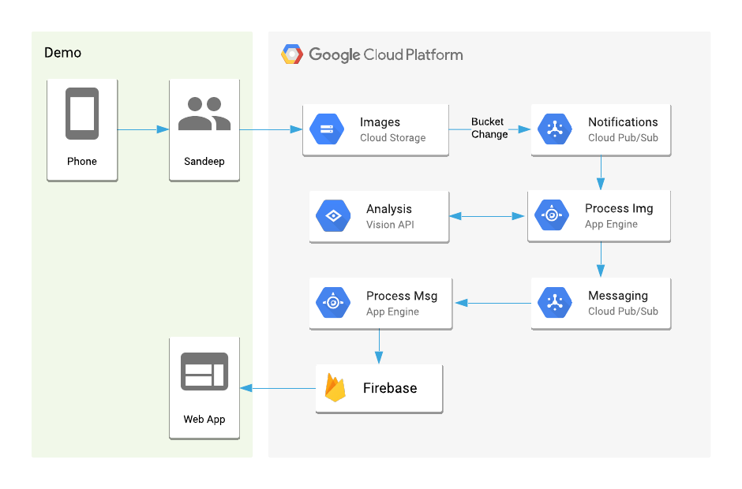

# Proactively Stocking Inventory using ML

## Background

How do you notify store associates when items are out of stock? What if you could leverage footage from in-store cameras to detect when stock is low for items that have a quick turnover (like produce) and have those refilled before running out? 

In [this session](https://cloud.withgoogle.com/next18/sf/sessions/session/155904) from Google Cloud Next 2018, we walked through an architecture that describes how to combine camera footage, the Cloud Vision API, and Firebase to deliver an end-to-end use case to help shoppers get the products they need without having to wait.

## Architecture



## Process Flow

- Images are uploaded to a [Cloud Storage](https://cloud.google.com/storage) bucket
- Cloud Storage bucket notifications are sent to a [Cloud Pub/Sub](https://cloud.google.com/pubsub) topic
- Cloud Pub/Sub push subscription sends message to [App Engine](https://cloud.google.com/appengine) `Inventory` service
- `Inventory` service sends image to [Cloud Vision API](https://cloud.google.com/vision)
- Based on Vision API response, `Inventory` sends message to a Pub/Sub topic
- Cloud Pub/Sub push subscription to App Engine `Messaging` service
- `Messaging` service uses [Firebase](https://firebase.google.com) Admin API to send device notification
- Firebase delivers push notification to `Staff App`

## Deploying

### App Engine

```
$ gcloud app deploy \
default-service/app.yaml \
inventory-service/app.yaml \
messaging-service/app.yaml
```

### Cloud Storage and Cloud Pub/Sub

Edit `setup.sh` with the following information:
* Cloud Storage bucket name (`BUCKET_NAME`)
* App Engine endpoints (`INVENTORY_ENDPOINT` and `MESSAGING_ENDPOINT`)

```
$ ./setup.sh all up
```

### Firebase
```
$ cd staff-app
$ firebase deploy
```

Once the Firebase app has been deployed, navigate to it and generate a new push token. Copy that token and run the following:

```
$ ./update-metadata.sh [TOKEN]
```

## Requirements
* [Google Cloud](https://cloud.google.com) project
* Install and setup [gcloud](https://cloud.google.com/sdk)
* Install and setup [Firebase SDK](https://firebase.google.com/docs/web/setup)
